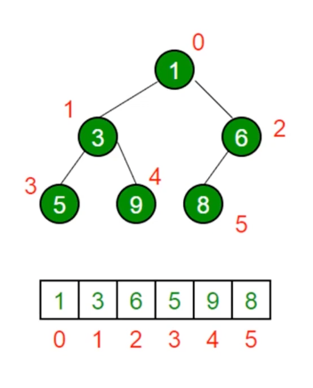

# JavaScript 数据结构与算法学习

## 时间复杂度和空间复杂度

### 时间复杂度

算法的时间复杂度表示程序运行所需要的时间，它定性的描述程序运行的时间，用大 O 表示，常见的时间复杂度为 O(1)、O(n)、O(logN)、O(n2)、没有循环的时间复杂度为 O(1), 有一层循环的为 O(n), n 为循环的次数

### 空间复杂度

空间复杂度用来表示程序运行过程中临时占用内存空间大小的量度，同样也是用大 O 来表示

## 数据结构

### 分类

#### 逻辑结构

- **线性结构**：是一个有序数据元素的集合。 其中数据元素之间的关系是一对一的关系，即除了第一个和最后一个数据元素之外，其它数据元素都是首尾相接的。
  常用的线性结构有: `栈，队列，链表`。

- **非线性的结构**：各个数据元素不再保持在一个线性序列中，每个数据元素可能与零个或者多个其他数据元素发生联系。
  常用的线性结构有: `树、图、堆、字典、集合`。

#### 存储结构

逻辑结构指的是数据间的关系，而存储结构是逻辑结构用计算机语言的实现。常见的存储结构有**顺序存储**、**链式存储**、**索引存储**以及**散列存储**

例如：栈和队列（JS 中为数组）在内存中的位置是连续的，它就属于顺序存储；链表是主动建立数据间的关联关系的，在内存中却不一定是连续的，它属于链式存储；还有顺序和逻辑上都不存在顺序关系，但是你可以通过一定的方式去访问它的字典和集合，是数据散列存储的。

### 栈(Stack)

特点：后进先出

使用场景： [十进制转二进制](./code/stack/decimalToBinary.js)、JS 函数调用堆栈

JS 中使用： 使用 Array 模拟栈，push->入栈， pop->出栈

Leetcode 相关题：[20 有效括号](./leetcode/20.有效的括号.js)

### 队列(Queue)

特点：先进先出

使用场景： 食堂排队打饭、JS 异步中的任务队列

JS 中使用： 使用 Array 模模拟, push->入队， shift->出队

Leetcode 相关题：[933 最近的请求次数](./leetcode/933.最近的请求次数.js)

### 链表(LinkedList)

概述：多个元素组成的列表，元素的存储不连续的，用 next 指针连接在一起

与数组区别：增删高效，增删复杂度为 O(1)，数组增删复杂度为 O(n)

js 中使用： 使用 Object 来模拟链表

JS 中相关知识点： [原型链、instanceof 的实现](./原型链.md)

常见操作： [删除节点、插入节点、遍历链表](./code/linkedList/index.js)

Leetcode 相关题：

[2 两数相加](./leetcode/2.两数相加.js)

[83 删除排序链表中重复的元素](./83.删除排序链表中重复的元素.js)

[141 环形链表](./leetcode/141.环形链表.js)

[206 反转链表](./206.反转链表.js)

[237 删除链表中的节点](./leetcode/237.删除链表中的节点.js)

### 集合(Set)

特点：一种无序且唯一的数据结构， ES6 中的 Set， （栈、队列、链表都是有序的数据结构）

常见操作：[去重、判断元素是否存在集合中、求交集](./code/set/index.js)

Leetcode 相关题：[349 两个数组的交集](./leetcode/349.两个数组的交集.js)

### 字典/哈希表(Map)

特点：与集合类似，字典也是一种存储唯一值的数据结构，但它是以键值对的形式来存储的，ES6 中的 Map, 也可以用 Object 来实现

常见操作：键值对的增删改查（Map 中的 set、get、has、delete、clear）

Leetcode 相关题：

[1 两数之和](./leetcode/1两数之和)

[3 无重复的最小子串](./leetcode/3.无重复的最小子串)

[20 有效的括号](./leetcode/20.有效的括号)

[76 最小覆盖子串](./leetcode/76.最小覆盖子串)

[349 两个数组的交集](./leetcode/349.两个数组的交集)

常见解法总结：

滑动窗口解法

双指针解法

### 树(Tree)

概述：一种分层数据的抽象模型，JS 中没有树，但是可以用 Object 和 Array 构建树

使用场景：DOM 树、树形控件、级联选择

遍历方法：[深度优先遍历（depth-first-search）/ 广度优先遍历（breadth-first-search）](./code/tree/tree.js)

#### 二叉树(BinaryTree)

概述：是一种特殊的树，一个节点最多只有两个叶子节点，js 中使用 Object 来模拟二叉树

遍历方式：

1. [先序遍历(preorder)--递归与非递归方式](./code/tree/preorder.js)

   

2. [中序遍历(inorder)--递归与非递归方式](./code/tree/inorder.js)

   

3. [后序遍历(postorder)--递归与非递归方式](./code/tree/postorder.js)

   

Leetcode 相关题：

[94 二叉树的中序遍历](./leetcode/94.二叉树的中序遍历.js)

[102 二叉树的层序遍历](./leetcode/102.二叉树的层序遍历.js)

[104 二叉树的最大深度](./leetcode/104.二叉树的最大深度.js)

[111 二叉树的最小深度](./leetcode/111.二叉树的最小深度.js)

[112 路径总和](./leetcode/112.路径总和.js)

### 图(Graph)

概念： 图是网络结构的抽象模型，是一组由边连接的节点。图可以表示任何二元关系，比如道路、航班

图的表示方法：邻接矩阵、邻接表、关联矩阵...

邻接矩阵

邻接表

遍历方式：[深度优先遍历](./code/graph/dfs.js) 、[广度优先遍历](./code/graph/bfs.js)

Leetcode 相关题：

[65 有效数字](./leetcode/65.有效数字.js)

[133 克隆图](./leetcode/133.克隆图.js)

[417 太平洋大西洋水流问题](./leetcode/417.太平洋大西洋水流问题.js)

### 堆(Heap)

概念：堆是一种特殊的完全二叉树, 所有节点都大于等于（最大堆）或小于等于（最小堆）他的子节点

最小堆

最大堆：

JS 中堆的表示：

使用数组来表示堆，左侧子节点的位置是 `2*index +1`，右侧子节点的位置是 `2*index +2`，父节点位置是`（index-1）*2`

（index 为数组的索引）

[JavaScript 实现最小堆类](./leetcode/heap/minHeap.js)

堆的应用：

1. 堆能高效、快速地找出最大值和最小值，时间复杂度是 O(1)

2. 找出第 K 个最大元素步骤
   - 构建最小堆，将数组挨个插入到堆中
   - 当堆的大小超过 k 时，将堆顶元素删除
   - 当数组全部插入完后，堆顶即是第 k 个最大值

Leetcode 相关题：

[23 合并 K 个排序链表](./leetcode/23.合并K个排序链表)

[215 数组中的第 K 个最大元素](./leetcode/215.数组中的第K个最大元素.js)

[347 前 K 个高频元素](./leetcode/347.前K个高频元素.js)
